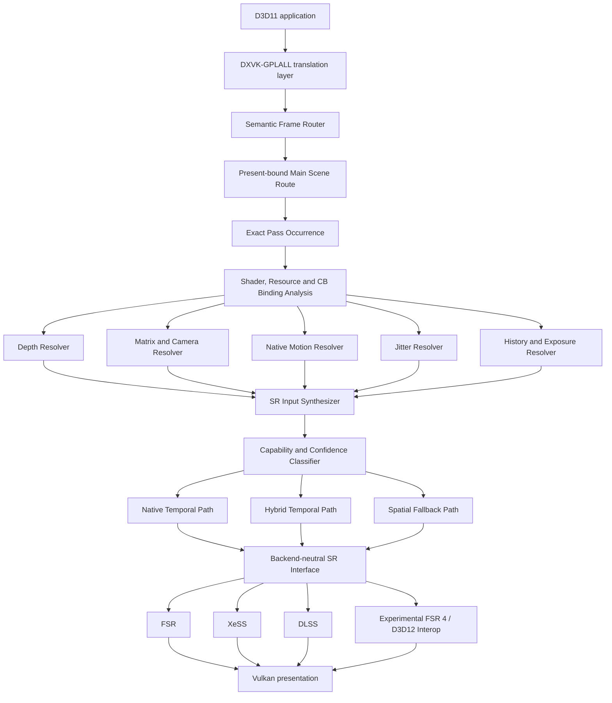

  

<h1 align="center">AXON-SRA</h1>

  <strong>Autonomous Semantic Render Analysis and Temporal Reconstruction for DXVK</strong>

  Reconstructing the rendering semantics and temporal inputs that modern super-resolution backends normally receive from native game integrations.

  
  
  
  
  

  <a href="docs/vision.md">Vision</a>
  ·
  <a href="docs/architecture.md">Architecture</a>
  ·
  <a href="docs/runtime-pipeline.md">Runtime pipeline</a>
  ·
  <a href="docs/roadmap.md">Roadmap</a>
  ·
  <a href="docs/status.md">Status</a>
  ·
  <a href="CONTRIBUTING.md">Contributing</a>

> [!NOTE]
> **Publication status:** This repository currently presents the public architecture, product vision, engineering principles, and validation model. The source tree is being cleaned and validated before publication. No end-user binary release is available yet. 

> [!IMPORTANT]
> AXON-SRA is an independent research project. The capabilities described below define the **target system**, not a claim that every feature is already production-ready or universally compatible.

## Mission

Modern temporal super-resolution systems require semantic inputs such as depth, motion, jitter, exposure, frame history, disocclusion information, and current-versus-previous camera state. D3D11 applications do not expose these inputs through one standardized reconstruction interface.

**AXON-SRA is designed to recover that missing semantic layer inside DXVK-GPLALL.**

The project analyzes the translated rendering workload, identifies the present-bound main scene route, reconstructs temporal inputs with explicit confidence and provenance, and exposes them through a backend-neutral super-resolution contract.

## Final system objective

The completed AXON-SRA runtime is intended to:

- identify the primary scene and presentation route without modifying the original game;
- bind analysis to the exact pass occurrence, shader set, resources, and constant-buffer state;
- reconstruct depth, camera state, projection data, current and previous positions, native motion, and jitter;
- synthesize validated temporal reconstruction inputs;
- classify input quality and backend capability;
- select a native-temporal, hybrid-temporal, or spatial fallback path;
- dispatch compatible workloads to FSR, XeSS, DLSS, or an experimental FSR 4 / D3D12 interop path;
- preserve bounded execution, explicit ambiguity handling, and reproducible diagnostics.

## End-to-end architecture

## System pillars

| Pillar | Responsibility |
|---|---|
| **Observation** | Capture bounded, chronological evidence from DXVK without turning the hot path into a monolithic analysis engine |
| **Routing** | Identify the present-bound main scene and isolate the exact render-pass occurrence that matters |
| **Semantic reconstruction** | Infer depth, matrices, camera state, motion, jitter, history, and other temporal roles |
| **Input synthesis** | Convert heterogeneous evidence into a validated, backend-neutral temporal input set |
| **Confidence classification** | Decide whether a workload qualifies for native temporal, hybrid temporal, or spatial reconstruction |
| **Backend execution** | Dispatch the validated workload to FSR, XeSS, DLSS, or a compatible fallback |
| **Diagnostics and profiles** | Preserve provenance, expose structured logs, and support optional per-title semantic profiles |

## Reconstruction inputs

The final input contract is intended to support:

| Input | Target source |
|---|---|
| Current color | Present-bound scene route |
| Output dimensions | Presentation and target configuration |
| Depth | Resource-role and producer/consumer analysis |
| Motion | Native motion target, reconstructed position delta, or hybrid synthesis |
| Current / previous transforms | Constant-buffer observation and matrix classification |
| Jitter | Multi-frame projection and viewport correlation |
| Exposure | Shader/resource semantics and frame-to-frame behavior |
| Reactive / disocclusion information | Resource relationships, material behavior, and confidence heuristics |
| History | Cross-frame resource provenance and stable semantic profiles |

## Execution modes

AXON-SRA is designed around three explicit execution modes:

| Mode | Requirement | Intended behavior |
|---|---|---|
| **Native Temporal** | Required temporal inputs are reliable and backend-compatible | Use the highest-confidence temporal path |
| **Hybrid Temporal** | Some inputs are native while others can be reconstructed safely | Combine native and synthesized evidence with explicit confidence limits |
| **Spatial Fallback** | Temporal evidence is incomplete or ambiguous | Preserve compatibility without fabricating authoritative temporal data |

Read [Execution modes](docs/execution-modes.md) for the detailed decision model.

## Backend strategy

The reconstruction layer is backend-neutral by design.

| Backend | Final role |
|---|---|
| **FSR** | First open temporal backend and reference implementation path |
| **XeSS** | Cross-vendor temporal backend behind the common contract |
| **DLSS** | NVIDIA-specific backend when hardware, SDK, and input requirements are satisfied |
| **FSR 4 / D3D12 interop** | Experimental interop path using DXVK's D3D11-on-12 / Vulkan resource bridge where technically and legally viable |
| **Spatial fallback** | Compatibility path when temporal requirements cannot be met safely |

Backend presence does not override semantic confidence. AXON-SRA must reject or downgrade a path when required inputs are missing or unreliable.

## Final deliverable

The planned public release is intended to include:

- a DXVK-GPLALL-based runtime with integrated semantic render analysis;
- automatic D3D11 scene and temporal-input discovery;
- backend-neutral temporal input and dispatch interfaces;
- selectable FSR, XeSS, and DLSS execution paths;
- an experimental FSR 4 / D3D12 interop path;
- automatic capability and confidence-based fallback;
- optional per-title semantic profiles;
- structured diagnostics and validation logs;
- reproducible source builds;
- versioned binary releases;
- compatibility documentation for validated D3D11 titles.

## Engineering principles

1. **Observe before modifying.** Analysis must be measurable before reconstruction is introduced.
2. **Bind to the exact occurrence.** A shader or resource is not meaningful without its concrete frame, pass, and binding context.
3. **Use stable semantics, not transient handles.** Runtime IDs alone are not portable across frames, runs, or titles.
4. **Bound every analysis.** Journals, graph traversal, dataflow depth, pointer resolution, and scheduling cost require explicit limits.
5. **Preserve provenance.** Every semantic claim should remain traceable to evidence and confidence.
6. **Fail closed.** Ambiguous evidence remains ambiguous; it is not promoted into authoritative temporal input.
7. **Keep backends replaceable.** Semantic reconstruction must not be hard-wired to one vendor API.
8. **Minimize DXVK intrusion.** Integration points should remain controlled, reviewable, and ownership-safe.

## Development and validation

The active implementation progresses from frame and resource observation through semantic reconstruction, temporal input synthesis, backend abstraction, backend integration, and final multi-game hardening.

Primary validation workloads currently include:

- **Persona 5 Royal** — D3D11 feature level 11_0;
- **Subnautica** — D3D11 feature level 11_1.

A title is not considered supported merely because it launches. Compatibility requires stable observation, bounded cost, repeatable semantic classification, and reproducible diagnostics.

See:

- [Development status](docs/status.md)
- [Roadmap to v1.0](docs/roadmap.md)
- [Validation model](docs/validation.md)
- [Compatibility policy](docs/compatibility.md)

## Non-goals and limits

AXON-SRA does not promise that every D3D11 game can be integrated automatically. Some engines may not expose enough information for reliable temporal reconstruction.

The project will not:

- fabricate high-confidence motion or camera data from insufficient evidence;
- claim native-integration image quality without comparative validation;
- treat a successful launch as proof of semantic correctness;
- hide backend downgrade or fallback decisions;
- require modifications to the original game source code as its default operating model.

## Contributing

The most valuable contributions are reproducible compatibility reports, minimized shader/resource cases, bounded SPIR-V analysis improvements, architecture review, validation tooling, and documentation corrections.

Read [CONTRIBUTING.md](CONTRIBUTING.md) before opening an issue or pull request.

## Independence and trademarks

AXON-SRA is an independent community research project. It is not affiliated with, endorsed by, or sponsored by DXVK, the Khronos Group, Microsoft, NVIDIA, AMD, Intel, or any game publisher.

All product names, trademarks, and registered trademarks remain the property of their respective owners.

## Licensing

See [LICENSE](LICENSE) and [THIRD_PARTY_NOTICES.md](THIRD_PARTY_NOTICES.md).

When the DXVK-derived source tree is published, upstream copyright, license, and attribution notices will be preserved. Vendor SDKs and redistributable components remain subject to their own terms.

---

  Built by <a href="https://github.com/AsynKhronos">AsynKhronos</a>.

