  

<h1 align="center">AXON-SRA</h1>

  <strong>Semantic Render Analysis for DXVK</strong>

  Experimental infrastructure for reconstructing render semantics and temporal inputs from D3D11 workloads translated through DXVK.

  
  
  
  

  <a href="docs/README.md">Documentation</a>
  ·
  <a href="docs/architecture.md">Architecture</a>
  ·
  <a href="docs/status.md">Development status</a>
  ·
  <a href="docs/roadmap.md">Roadmap</a>
  ·
  <a href="CONTRIBUTING.md">Contributing</a>

> [!NOTE]
> **Repository status:** This repository currently contains the public
> documentation and project architecture. The source tree is being cleaned,
> validated, and prepared for publication. No end-user build or release is
> available yet.

> [!IMPORTANT]
> AXON-SRA is an active research prototype. It is **not** a production-ready upscaler, a universal game patch, or an official DXVK feature. Interfaces, heuristics, file layouts, and observed metrics may change without compatibility guarantees.

## What AXON-SRA is

Temporal reconstruction systems require more than a low-resolution color buffer. They commonly depend on motion, depth, jitter, exposure, history, disocclusion, and other frame-to-frame signals. D3D11 applications do not expose these semantics through a standardized interface.

AXON-SRA investigates whether those signals can be reconstructed inside DXVK by combining:

- stable resource and view identities;
- per-frame observation journals and immutable frame snapshots;
- resource-flow and producer-provenance analysis;
- scene and presentation routing;
- shader semantic caching;
- bounded SPIR-V backward dataflow;
- confidence-based classification rather than hard-coded resource IDs.

The long-term objective is to expose validated temporal inputs through a backend-neutral reconstruction interface.

## Current scope

| Area | Current position |
|---|---|
| Graphics API | D3D11 is the primary acceptance target |
| Translation layer | Integrated into a DXVK-GPLALL development tree |
| Analysis model | Resource, frame, scene, shader, and provenance layers |
| Current milestone | Phase 9 — bounded `BuiltIn Position` backward dataflow |
| Reconstruction backend | Planned; no public production backend yet |
| Validation titles | Persona 5 Royal and Subnautica |
| D3D9 | Not a current acceptance criterion |

## Architecture

```mermaid
flowchart LR
    A[D3D11 workload] --> B[DXVK translation]
    B --> C[Controlled observation hooks]
    C --> D[Frame journal]
    D --> E[Frame model]
    E --> F[Sealed frame]
    F --> G[Resource graph]
    G --> H[Scene router]
    H --> I[Analysis scheduler]
    I --> J[Shader semantic cache]
    J --> K[Bounded SPIR-V dataflow]
    K --> L[Semantic candidates]
    L -. future .-> M[Temporal input synthesis]
    M -. future .-> N[DLSS / FSR / XeSS or custom backend]
```

The design intentionally avoids a single monolithic manager. Each layer owns a narrow responsibility and communicates through explicit data structures.

## Core components

| Component | Responsibility |
|---|---|
| `sr_ids` | Stable identifiers for observed render entities |
| `sr_frame_journal` | Bounded event capture for the active frame |
| `sr_frame_model` | Normalized frame-level observations |
| `sr_sealed_frame` | Immutable analysis snapshot |
| `sr_resource_graph` | Resource relationships and producer provenance |
| `sr_scene_router` | Scene/presentation segmentation and routing |
| `sr_analysis_scheduler` | Controlled analysis cadence and workload |
| `sr_shader_semantic_cache` | Cached shader-level semantic evidence |
| `sr_position_dataflow` | Bounded backward tracing from exact position stores |

More detail is available in the [architecture documentation](docs/architecture.md).

## Development status

The Phase 8.2 validation baseline completed a 6,144-frame run with:

- `2,183,445` indexed provenance lookups;
- `437,284` scanned index entries;
- approximately `0.20` scanned entries per lookup;
- `0` memory ambiguities;
- `0` dropped handoffs;
- `0` dropped journal events.

These are engineering diagnostics, **not image-quality or performance claims**. See [Development status](docs/status.md) and [Validation](docs/validation.md).

## Design principles

1. **Observe before modifying.** Analysis must be measurable before reconstruction is introduced.
2. **Use stable semantics, not transient IDs.** Resource handles alone are not portable across runs or titles.
3. **Bound every analysis.** Dataflow depth, node count, journal size, and scan cost must remain finite.
4. **Preserve provenance.** Every semantic claim should be traceable to observations and confidence evidence.
5. **Fail closed.** Ambiguous signals remain candidates; they are not silently promoted to authoritative inputs.
6. **Minimize DXVK intrusion.** Integration should use a small number of controlled hooks and explicit ownership.

## Repository state

The repository remains under active development. Source publication, build instructions, and release artifacts should only be considered authoritative once the corresponding baseline is committed and tagged.

## Roadmap

Near-term work is focused on:

- completing bounded position-source dataflow;
- classifying uniform-buffer, push-constant, and shader-input contributors;
- identifying camera, projection, and jitter sources;
- strengthening depth, history, motion, and presentation-role confidence;
- defining a backend-neutral temporal input contract;
- validating behavior across multiple D3D11 engines;
- publishing a reproducible source and build baseline.

See the full [roadmap](docs/roadmap.md).

## Contributing

Compatibility reports, reproducible logs, architecture review, and focused documentation corrections are useful. Large implementation pull requests should begin with an issue because internal interfaces are still moving.

Read [CONTRIBUTING.md](CONTRIBUTING.md) before opening a pull request.

## Independence and trademarks

AXON-SRA is an independent community research project. It is not affiliated with, endorsed by, or sponsored by the Khronos Group, DXVK, NVIDIA, AMD, Intel, Microsoft, or any game publisher.

All product names, trademarks, and registered trademarks are property of their respective owners.

## License

See [LICENSE](LICENSE). When the DXVK-based source tree is published, upstream license and attribution notices must remain intact.

---

  Built by <a href="https://github.com/AsynKhronos">AsynKhronos</a>.

