# System architecture

AXON-SRA is structured as a set of narrow layers with explicit ownership. The architecture avoids a single global manager that captures, analyzes, classifies, synthesizes, and dispatches everything from one object.

## High-level architecture

```mermaid
flowchart TD
    subgraph Capture["1. DXVK observation"]
        A1[Stable IDs]
        A2[Chronological Frame Journal]
        A3[State Interning]
        A4[Controlled Hook Points]
    end

    subgraph Frame["2. Frame normalization"]
        B1[Frame Model]
        B2[Sealed Frame]
        B3[Resource Graph]
        B4[Producer Provenance]
    end

    subgraph Route["3. Scene routing"]
        C1[Present-root Detection]
        C2[Main Scene Route]
        C3[Exact Pass Occurrence]
        C4[Shader and Binding Context]
    end

    subgraph Semantic["4. Semantic reconstruction"]
        D1[Shader Semantic Cache]
        D2[Position Dataflow]
        D3[CB Binding and Value Analysis]
        D4[Matrix and Camera Classification]
        D5[Depth, Motion and Jitter Resolvers]
    end

    subgraph Synthesis["5. Temporal input synthesis"]
        E1[Input Normalization]
        E2[Confidence Model]
        E3[Capability Classification]
        E4[Native / Hybrid / Spatial Decision]
    end

    subgraph Backend["6. Backend execution"]
        F1[Backend-neutral Contract]
        F2[FSR]
        F3[XeSS]
        F4[DLSS]
        F5[FSR 4 / D3D12 Interop]
    end

    Capture --> Frame --> Route --> Semantic --> Synthesis --> Backend
```

## 1. Observation layer

The observation layer records only the evidence required by later analysis.

Responsibilities:

- stable render-entity identifiers;
- canonical state interning;
- chronological events;
- explicit dropped-event counters;
- bounded storage;
- minimal work inside DXVK hot paths.

No high-level semantic decision belongs in the capture path.

## 2. Frame and provenance layer

The active journal is normalized into a frame model and then sealed into immutable analysis data.

The resource graph records:

- reads and writes;
- views and underlying resources;
- producer and consumer relationships;
- render-target and depth usage;
- presentation relationships;
- inter-frame recurrence;
- history-like feedback;
- indexed producer provenance.

Sealed frames protect analysis from live-state mutation and make handoff boundaries explicit.

## 3. Scene-routing layer

Scene routing identifies the render route that actually reaches presentation.

The router must distinguish:

- main 3D scene;
- post-processing;
- UI and overlays;
- video or cutscene paths;
- unrelated off-screen work;
- final composition and presentation.

A semantic claim is only meaningful when bound to the exact frame, pass occurrence, shader set, and binding context.

## 4. Semantic-reconstruction layer

The semantic layer combines:

- immutable SPIR-V analysis;
- exact output-store tracing;
- bounded interprocedural dataflow;
- constant-buffer binding and value observation;
- multi-frame value correlation;
- matrix and camera classification;
- depth-role classification;
- native motion discovery;
- jitter inference;
- history and exposure relationships.

Results retain provenance, completeness, and confidence.

## 5. Input-synthesis layer

The synthesizer converts heterogeneous evidence into a normalized temporal input contract.

It must:

- verify required dimensions and coordinate conventions;
- normalize current and previous state;
- reject stale or cross-route resources;
- detect missing inputs;
- attach confidence and provenance;
- determine whether native-temporal, hybrid-temporal, or spatial execution is valid.

## 6. Backend layer

Backends consume the common contract rather than querying DXVK internals directly.

This separation allows:

- multiple vendor backends;
- consistent capability checks;
- backend-specific resource transitions;
- explicit fallback;
- independent validation;
- future replacement without rewriting semantic discovery.

## Ownership rules

1. DXVK objects own observation entry points.
2. AXON-SRA owns normalized analysis data.
3. Sealed frames and shader semantics are immutable downstream inputs.
4. Backends receive explicit resources and metadata through the common contract.
5. No backend may reinterpret ambiguous evidence as authoritative without a classifier decision.

## Failure model

AXON-SRA fails closed.

A result remains unresolved when:

- pointer arithmetic cannot be resolved safely;
- multiple producers remain plausible;
- a dataflow or graph bound is reached;
- current and previous state cannot be distinguished;
- resource roles conflict;
- cross-frame evidence is insufficient;
- backend requirements are not satisfied.

The runtime may downgrade to a safer mode, but it must not silently fabricate certainty.
