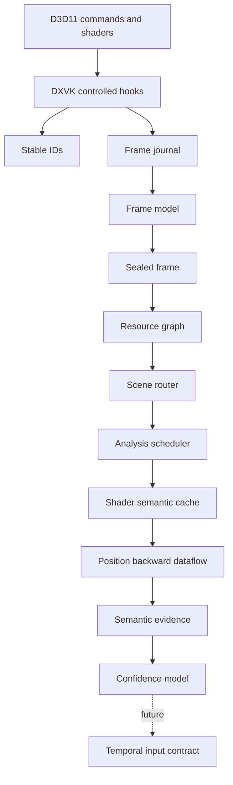

# System architecture

AXON-SRA is structured as a layered subsystem rather than a monolithic render-analysis manager. The goal is to keep DXVK integration narrow, analysis bounded, and semantic conclusions auditable.

## Data path

## Layer responsibilities

### Stable identity

`sr_ids` separates long-lived analysis identity from transient API handles. The analysis layer must not depend on resource IDs remaining stable across runs.

### Observation journal

`sr_frame_journal` captures a bounded event stream for the current frame. It records only the information required for later normalization and analysis.

Key properties:

- finite capacity;
- explicit dropped-event counters;
- low-cost write path;
- no semantic decisions in the capture layer.

### Frame model

`sr_frame_model` normalizes raw observations into a coherent frame representation. It resolves repeated state and prepares data for immutable analysis.

### Sealed frame

`sr_sealed_frame` is an immutable snapshot. Analysis operates on sealed data rather than live DXVK state, reducing ownership ambiguity and accidental cross-thread mutation.

### Resource graph

`sr_resource_graph` models reads, writes, views, producers, consumers, and cross-frame relationships. Indexed producer provenance avoids repeatedly scanning large event histories.

### Scene router

`sr_scene_router` separates scene activity from presentation, overlays, post-processing, and unrelated render paths. It routes relevant work into the analysis pipeline.

### Analysis scheduler

`sr_analysis_scheduler` controls when expensive work may run. Analysis is deliberately sampled and bounded rather than executed indiscriminately on every event.

### Shader semantic cache

`sr_shader_semantic_cache` stores immutable shader-level findings so SPIR-V analysis is not repeated for every frame or draw.

### Position dataflow

`sr_position_dataflow` traces backward from exact `BuiltIn Position` stores and records contributing inputs, push constants, and uniform-buffer ranges.

The trace is bounded by:

- maximum node count;
- maximum dataflow depth;
- maximum pointer-resolution depth.

## Ownership model

The subsystem follows three rules:

1. DXVK objects own observation entry points.
2. The SR subsystem owns normalized analysis data.
3. Sealed frames and cached shader semantics are immutable to downstream readers.

## Failure model

AXON-SRA does not convert uncertainty into certainty.

A candidate may remain unresolved when:

- pointer arithmetic is dynamic;
- multiple producers are plausible;
- dataflow limits are reached;
- resource roles conflict;
- cross-frame evidence is insufficient.

Ambiguity is reported and measured. It is not hidden behind a default classification.

## Controlled integration

The intended integration strategy is:

- a small number of explicit DXVK hooks;
- no broad interception layer;
- no direct dependency of core DXVK code on high-level reconstruction backends;
- backend integration only after semantic inputs are independently validated.
