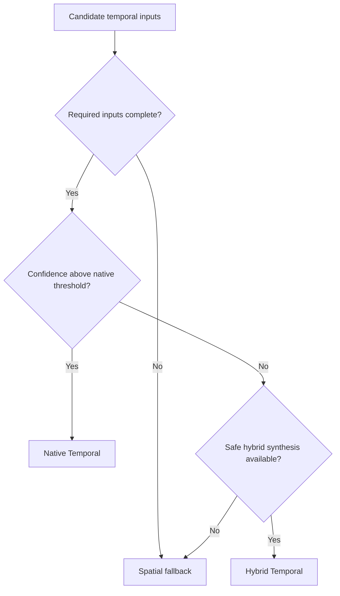

# Execution modes

AXON-SRA separates semantic confidence from backend preference.

Selecting a backend does not automatically authorize a temporal path.

## Native Temporal

Use when required inputs are directly identified or reconstructed with high confidence.

Typical requirements:

- correct main-scene color;
- route-matched depth;
- reliable motion;
- valid current and previous frame relationship;
- known jitter;
- compatible exposure/history behavior;
- backend requirements satisfied.

This is the preferred mode.

## Hybrid Temporal

Use when some inputs are native and others can be synthesized safely.

Examples:

- native depth with reconstructed camera motion;
- native motion with inferred jitter;
- native current transform with reconstructed previous transform;
- backend-specific reactive-mask synthesis.

Hybrid mode must expose which inputs are synthesized and why they are considered safe.

## Spatial Fallback

Use when temporal evidence is incomplete, ambiguous, or incompatible.

Spatial fallback preserves usability without creating false temporal certainty.

It may include:

- spatial scaling;
- sharpening;
- native-resolution pass-through;
- explicit backend disablement.

## Decision model

## Required diagnostics

Every mode decision should expose:

- selected mode;
- selected backend;
- missing inputs;
- synthesized inputs;
- confidence thresholds;
- downgrade reason;
- profile influence;
- history-reset state.
