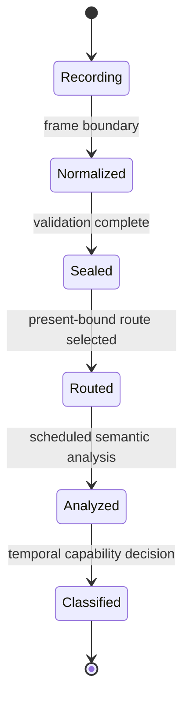

# Frame and resource model

## Frame lifecycle

## Recording

Controlled hooks append low-cost observations to the active frame journal.

Requirements:

- bounded capacity;
- chronological order;
- explicit overflow counters;
- no heavy semantic analysis;
- stable identifiers instead of raw pointer assumptions.

## Normalization

Repeated and transient state is converted into canonical references.

Examples:

- interned pipeline and binding state;
- stable resource/view IDs;
- normalized pass occurrences;
- shader identity;
- presentation metadata.

## Sealing

The frame becomes immutable before asynchronous analysis.

This provides:

- clear ownership;
- deterministic handoff;
- no accidental mutation of live DXVK state;
- reproducible analysis input;
- bounded dropped-handoff accounting.

## Resource graph

The resource graph models:

- resource and view identity;
- read and write edges;
- attachments;
- producers and consumers;
- pass ordering;
- present-root relationships;
- inter-frame recurrence;
- history-like carry;
- ping-pong patterns;
- resource aliases where safely resolvable.

## Indexed producer provenance

Producer lookup should avoid broad rescanning.

Indexed provenance allows analysis to query likely producers using bounded, relevant subsets rather than walking the full event history repeatedly.

## Semantic profiles

Profiles should store semantic relationships rather than one run's raw handles.

Potential profile content:

- route fingerprints;
- shader identities;
- expected binding patterns;
- confidence adjustments;
- known backend restrictions;
- title/version identifiers.

Profiles are optional accelerators and compatibility aids. Runtime evidence remains authoritative.
