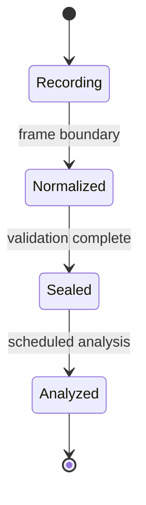

# Frame and resource model

AXON-SRA reconstructs semantics by combining evidence across resources, passes, shaders, and frames.

## Frame lifecycle



### Recording

Low-cost hooks append observations to the active journal.

### Normalization

Transient command details are converted into stable resource, view, pass, and shader references.

### Sealing

The frame becomes immutable. Downstream analysis cannot mutate live capture state.

### Analysis

The scheduler selects bounded work such as provenance indexing, scene routing, and shader-semantic correlation.

## Resource graph

The graph models:

- resource and view identity;
- read/write edges;
- producer and consumer relationships;
- pass ordering;
- attachment usage;
- cross-frame recurrence;
- history-like carry and feedback;
- scene and presentation routing.

## Indexed provenance

Broad historical scans are expensive and introduce unstable cost. Phase 8.2 introduced indexed producer provenance so a lookup inspects only relevant entries.

In the validated 6,144-frame run:

```text
memoryIndexLookups  = 2,183,445
memoryIndexScanned  =   437,284
average scan        ≈      0.20 entries per lookup
memoryAmbiguities   =         0
droppedHandoffs     =         0
journalDroppedEvents=         0
```

These counters describe the tested workload and implementation baseline. They are not universal guarantees.

## Semantic profiles

The design favors semantic mappings such as:

- depth;
- current color;
- history;
- motion;
- jitter;
- output;

rather than persistent raw resource IDs.

A future profile format may store validated semantic relationships per title while remaining independent of one specific run's handles.
