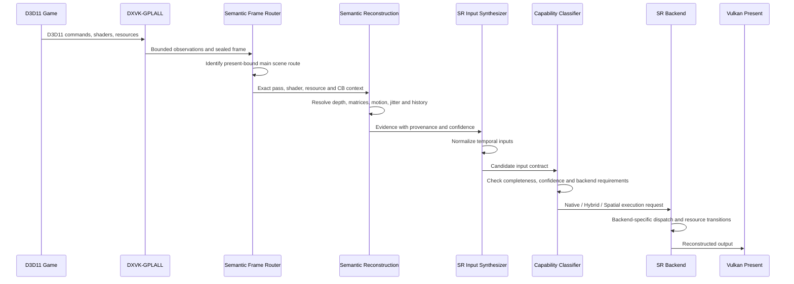

# Runtime pipeline

This document describes the intended end-to-end runtime behavior.

## Pipeline

## Stage 1 — observation

DXVK records bounded evidence at controlled integration points.

Examples:

- shader identity and stage;
- bound resources and views;
- render-target and depth state;
- viewport and presentation dimensions;
- draw/dispatch occurrence;
- resource reads and writes;
- frame boundaries;
- relevant constant-buffer bindings.

## Stage 2 — frame sealing

At a frame boundary:

1. the active journal is normalized;
2. transient state is interned;
3. a frame model is created;
4. the frame is sealed;
5. analysis receives immutable data through a bounded handoff.

## Stage 3 — route selection

The scene router traces backward from presentation to locate the most plausible main-scene route.

It identifies:

- the present root;
- the root writer pass;
- post-process chains;
- inter-frame ping-pong;
- exact target-draw occurrences;
- shader and resource context.

## Stage 4 — semantic reconstruction

The semantic subsystem analyzes the selected route.

Target outputs include:

- depth;
- current and previous position contributors;
- current and previous camera/projection transforms;
- viewport and inverse-resolution values;
- jitter;
- native motion;
- history;
- exposure;
- reactive or disocclusion evidence.

## Stage 5 — input synthesis

The synthesizer builds one normalized input package.

It resolves:

- input and output dimensions;
- resource formats and coordinate conventions;
- current/previous frame relationships;
- motion scale and direction;
- jitter units;
- exposure representation;
- confidence and completeness.

## Stage 6 — capability classification

The classifier selects one of three modes:

- native temporal;
- hybrid temporal;
- spatial fallback.

Selection depends on:

- required input availability;
- confidence thresholds;
- backend hardware/API support;
- resource compatibility;
- profile policy;
- known title-specific constraints.

## Stage 7 — backend dispatch

The selected backend receives only validated contract data.

Backend-specific code owns:

- SDK feature creation;
- quality mode mapping;
- resource-state transitions;
- dispatch;
- backend-specific diagnostics;
- teardown and recovery.

## Stage 8 — presentation and diagnostics

The reconstructed output is returned to the Vulkan presentation path.

Structured diagnostics should expose:

- selected scene route;
- classified semantic inputs;
- confidence and provenance;
- execution mode;
- backend selection;
- fallback or rejection reason;
- boundedness and dropped-work counters.
